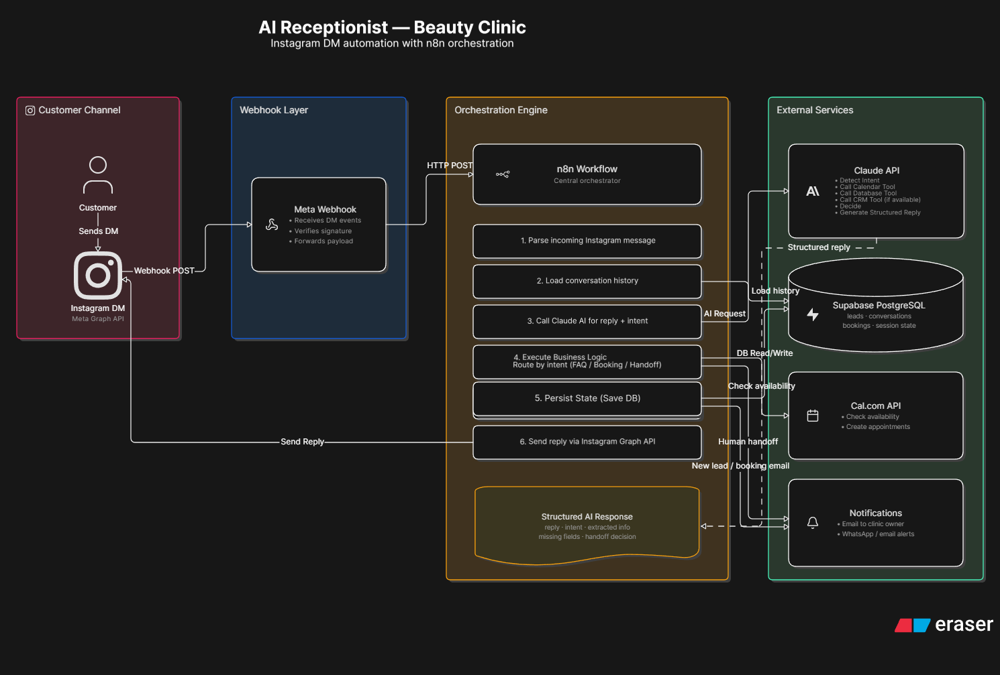

# 🤖 Beauty Clinic AI Receptionist

An AI-powered virtual receptionist that automates Instagram Direct Messages for beauty clinics.

The system can answer customer questions, qualify leads, collect booking information, suggest appointments, store customer data, notify clinic staff, and seamlessly hand conversations over to a human when needed.

This project is being built as a real-world AI automation system while following software engineering best practices.

---

## ✨ Features

- 💬 Answer frequently asked questions
- 📅 Collect booking information
- 👤 Qualify potential customers
- 🧠 AI-powered conversation management
- 📝 Conversation memory
- 💾 Save customer information
- 🔔 Notify clinic staff
- 🤝 Human handoff
- 📊 Lead status tracking

---

## 🏗️ System Architecture

> Architecture diagram



---

## 🛠️ Tech Stack

### AI
- OpenAI / Gemini
- Prompt Engineering
- Structured Outputs (Function Calling)

### Automation
- n8n

### Backend
- FastAPI
- Python

### Database
- PostgreSQL (Supabase)

### Integrations
- Meta Graph API
- Instagram Messaging API
- Meta Webhooks

### Infrastructure
- Docker
- Hostinger VPS

---

## 📂 Project Structure

```text
Beauty-Clinic-AI-Receptionist/
│
├── app/                     # Backend source code
├── database/                # Database schema & SQL
├── docs/                    # Documentation & diagrams
│   └── architecture/
├── workflows/               # n8n workflows
│
├── README.md
├── LESSONS_LEARNED.md
├── FUTURE_FEATURES.md
├── .env
└── .gitignore
```

---

## 🎯 Project Objectives

This project aims to build a production-ready AI receptionist capable of:

- Answering FAQs
- Qualifying leads
- Managing customer conversations
- Scheduling appointments
- Integrating with Instagram
- Storing customer information
- Notifying clinic staff
- Escalating conversations to humans when necessary

---

## 📚 Learning Goals

This project is helping me gain practical experience with:

- Large Language Models (LLMs)
- AI Automation
- Prompt Engineering
- Structured Outputs
- Conversation Memory
- n8n Workflows
- FastAPI
- PostgreSQL
- Meta Graph API
- Instagram Webhooks
- Docker
- VPS Deployment
- Software Architecture
- Production Deployment

---

## 🚀 Future Improvements

- Google Calendar integration
- Multi-language support
- Voice assistant integration
- Analytics dashboard
- CRM integration
- Appointment reminders
- Follow-up automation
- Multi-clinic support

---

## 📖 Documentation

Project documentation is available in the `docs/` folder, including:

- System Architecture
- Workflow Diagrams
- Database Design
- API Documentation 

---

## 👩‍💻 Author

**Meriem Louriachi**

Master's Student in Artificial Intelligence

Building AI agents, automation systems, and software that solve real-world business problems.

- GitHub: https://github.com/MeriemLouriachi
- LinkedIn: https://www.linkedin.com/in/louriachi-meriem-694a1024b/

---

## 📌 Project Status

🚧 Currently under active development as part of my AI Automation Engineering portfolio.